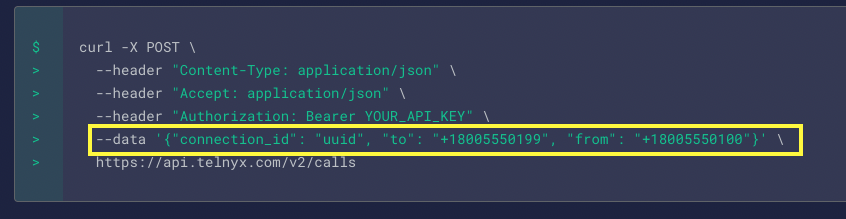
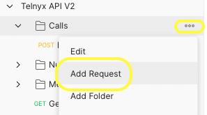
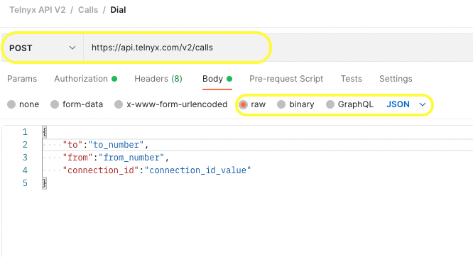
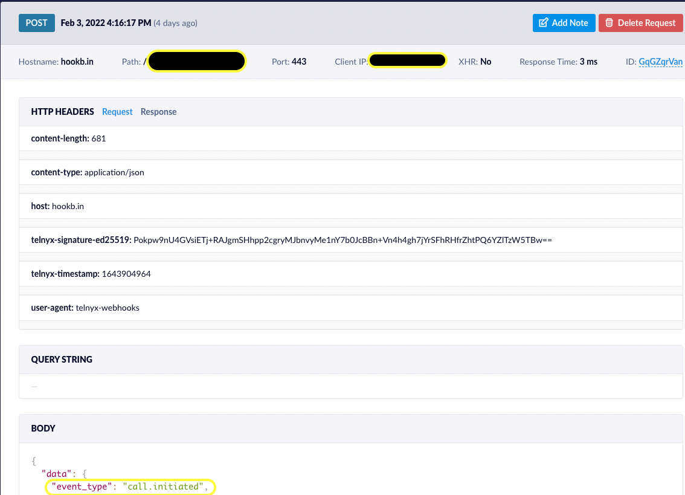

# Call Control Setup
<div align="center">

## _Make an Outbound Call from Call Control to Your Cellphone_


</div>

Tutorial demonstrating Telnyx Call Control API
-   Setting up an outbound voice profile
-   Setting up a call control application
-   Using hookbin
-   Order phone number
-   Add phone number to the call control application
-   Ring my mobile number from the newly purchased number & call control
-   Investigate the webhooks

## Requirements 
- A [Telnyx account](https://telnyx.com/sign-up) to use their Call Control web API. If you are new to Telnyx, create an [account](https://telnyx.com/sign-up) now and get 10$ credit to explore Telnyx platform.
- [Hookbin](https://hookbin.com/) for creating unique endpoints to inspect HTTP requests.
We will use this to inspect what's going on in realtime with our API calls.

## Environment Setup

### Telnyx Portal Setup
> Our beloved Telnyx Developer Relations team did an amazing job creating awesome documentation to get started with telnyx making it easy for developers get the taste of Telnyx.

Just follow the [steps here](https://developers.telnyx.com/docs/v2/call-control/quickstart) and make sure you accomplished the following:
- [x] Sign up for a free Telnyx account.
- [x] Create an outbound voice profile to make outbound calls.
- [x] Create a new endpoint at hookbin.com
- [x] Create a new Call Control application 
	- [x] Add webhook URL(endpoint from hookbin) and make sure you are using API v2
	- [x] Assign the new outbound voice profile created previously to this application
- [x] Buy a voice-capable phone number
- [x] Assign your phone number to your the call control app created in above step.
### Call Control API in Action

> This tutorial uses Postman but you can use any API testing platform.
> If you decided to use Postman and have not created an account yet, please do it from [here](https://www.postman.com/)

As we are looking to place an outbound call, let's head to the relevant API documentation for doing that [Developer Docs API V2 -> Call Cantrol -> Call Commands -> Dial](https://developers.telnyx.com/docs/api/v2/call-control/Call-Commands#callDial)

Based on the documentation, we need three things for making an outbound call as highlighted below:


So, let's grab those details:
1. *connection_id* : available under app info beside app name in [Mission Control Portal -> Call Control](https://portal.telnyx.com/#/app/call-control/applications) 
2. *to number* : Any number that you have access to with inbound capabilities (_You can use your personal phone number_)
3. *from number* : Number that is bought in the previous steps and available at [Mission Control Portal -> Numbers](https://portal.telnyx.com/#/app/numbers/my-numbers?current_page=1)

Once we have all the required details, let's head to Postman:
In Postman, Add a new request 
```
Collection Name -> Add Request
```


This opens a New Project window
- provide desired name, type of request(POST) with the [API URL] (https://api.telnyx.com/v2/calls) and add the following JSON data:
```json
{

"to":"to_number",

"from":"from_number",

"connection_id":"connection_id_value"

}
```



Replace the to_number, from_number and connection_id with the values we acquired before. 

##### Webhook Inspection with Hookbin
[Hookbin](https://hookbin.com/) is a free service that enables you to collect, parse, and view HTTP requests. 

- Once you replaced the relevant values, click send in the postman. 
- At this point you can head to the endpoint you created to inspect various events that get triggered in realtime. 
    (Example: https://hookbin.com/{your-unique-id})
- You should see the request details with the respective event_type and other details. 



If you refresh the hookbin URL after each event occurence such as call Dial, call answered and call ended, you should be able to see all those events over there respectively in the ordeer of occurence. 

| Call Action | Hookbin Event Type |
| ------ | ------ |
| Call dialed by Caller | call.initiated |
| Call answered by Receiver | call.answered |
| Call ended | call.hangup |


If you are more of a visual person, please watch the demonstration [here](https://www.loom.com/share/02978440734d4f4192c98eaf081a0a01)

You are now +1 step forward in your journey to becoming a Telnyx Champion, Wohooo !!!! 