# Telnyx Meet - Video SDK Demo using Next.js
<div align="center">

## _Make use of Telnyx Video SDK and API for building a sample app_


</div>

In this tutorial, we will explore how to use telnyx video sdk using the following steps:
- [Telnyx Portal Setup](#mission-control-portal-set-up)
- [Consuming Rooms API](#consuming-rooms-api)
- [Clone the Code](#clone-the-code)
- [Deploy your app](#deploy-on-vercel)

### Mission Control Portal Set Up
- [Sign up](https://telnyx.com/sign-up) for a free Telnyx account 
- Navigate to [API Keys](https://portal.telnyx.com/#/app/api-keys) section and create an API Key by clicking `Create API Key`  button. 
> `Note:` You need to obtain your API key so Telnyx can authenticate your [API requests](https://api.telnyx.com/v2/rooms)

### Consuming Rooms API
> This tutorial uses Postman but you can use any API testing platform.
> If you decided to use Postman and have not created an account yet, please do it from [here](https://www.postman.com/)
- After obtaining the API key from the above step, it is now time to consume it to create a new video room id using which you can join a telnyx video meet conference call. 
- Head over to [Developer Docs API V2 -> Video -> Rooms -> Create a room](https://developers.telnyx.com/docs/api/v2/video/Rooms#CreateRoom) and fetch commands for creating a Room using `createRoom`
- Based on the documentation, we do not have any required parameters but just let's use `enable_recording` set a limit of `max_participants`
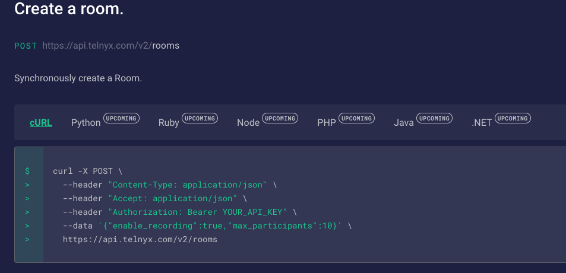
- In Postman, Click Import
```
Postman Dashboard -> Import
```
This opens a New Import window
- Go to Raw text and paste the entire cURL command from [here](https://developers.telnyx.com/docs/api/v2/video/Rooms#CreateRoom) 
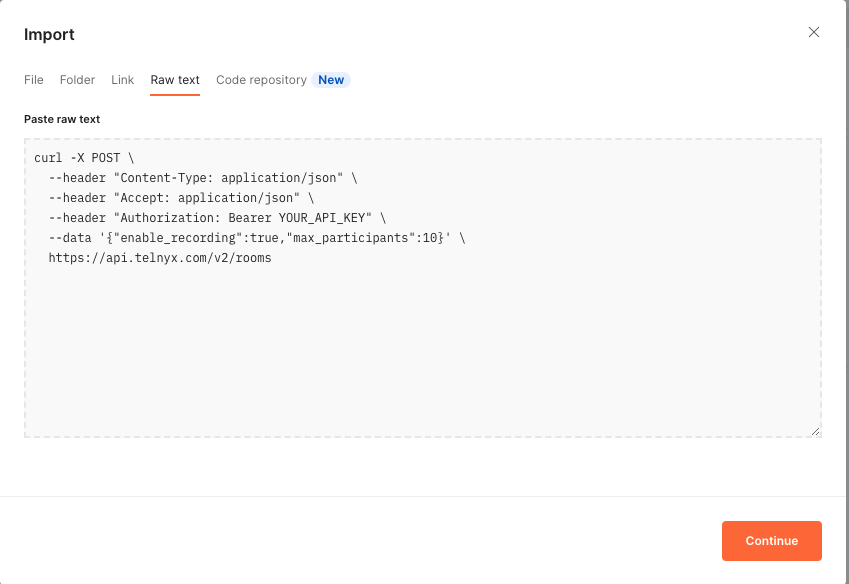
Click Continue and Import, then go to Header tab and replace `YOUR_API_KEY` with the API key you obtained previously
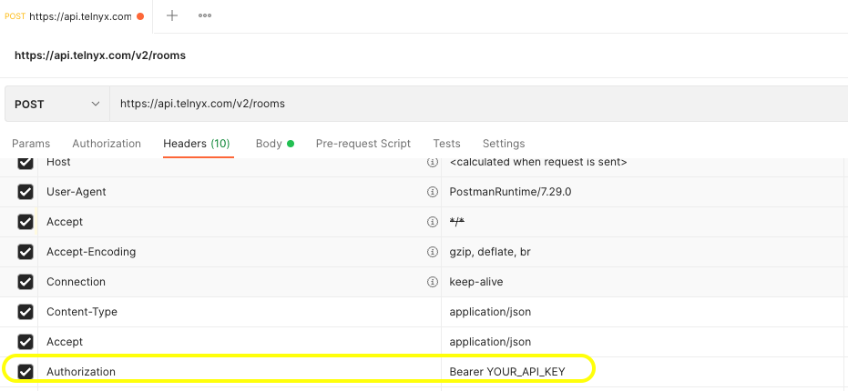
Then click Save and provide a relevant name for and save it in respective collection and folder so you can reuse the API call. 
Once saved, Click Send in Postman and you should get a similar response as shown below:

 ```json
{

"data": {

"active_session_id": null,

"created_at": "2022-04-05T11:14:08.962348Z",

"enable_recording": true,

"id": "room-id-will-be-here",

"max_participants": 10,

"record_type": "room",

"unique_name": null,

"updated_at": "2022-04-05T11:14:08.964184Z",

"video_codecs": [

"h264",

"vp8"

],

"webhook_event_failover_url": "",

"webhook_event_url": null,

"webhook_timeout_secs": null

}

}
```
Save the generated room `id` as you need it to join a video meet conference later. 

### Clone the Code
- Clone the telnyx-meet repo at [team-telnyx public github repo](https://github.com/team-telnyx/telnyx-meet)
>`git clone https://github.com/team-telnyx/telnyx-meet.git`
- Once you cloned the repo, create a copy of `.env.sample` with the name `.env.local` and set the env var `TELNYX_API_KEY` with your Telnyx API KEY value.
 >`cp .env.sample .env.local`
 
 Your `.env.local` file should look like this:

> TELNYX_API_HOST=https://api.telnyx.com/v2
> TELNYX_API_KEY="KEYae7df0................"

- You need Node.js >=12 and [yarn](https://yarnpkg.com/getting-started/install) to run the app locally
	- If you do not have yarn, install it usingthe following command:
	`sudo npm install -g yarn`
- Then run the following commands/follow the steps in order: 
	
	1 - `yarn` to install the dependencies.

    2 - `yarn dev` will initialize the server.
	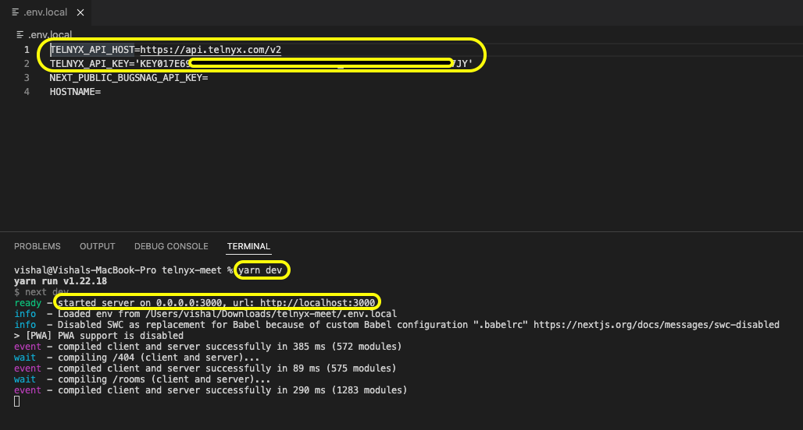

   3 - Access the `http://localhost:3000`
	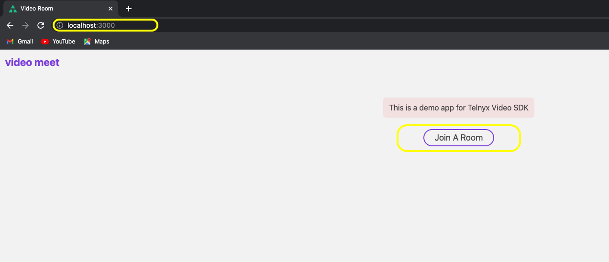

   4 - Click `Join A Room`and fill the input `Room UUID` with your generated `roomId` from previous step 
   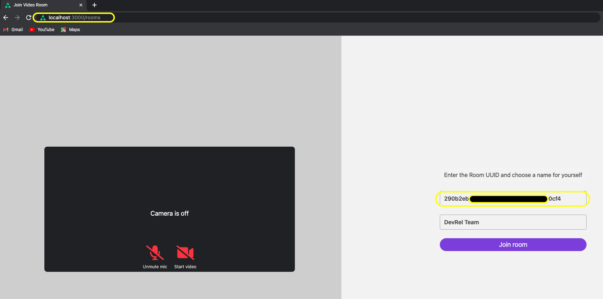
   
   **OR**
   you can go to [http://localhost:3000/Rooms/list](http://localhost:3000/Rooms/list) and then select one of the rooms created using your `API_KEY` if you created multiple rooms. Doing this will autofill the `Room UUID` for you. 
   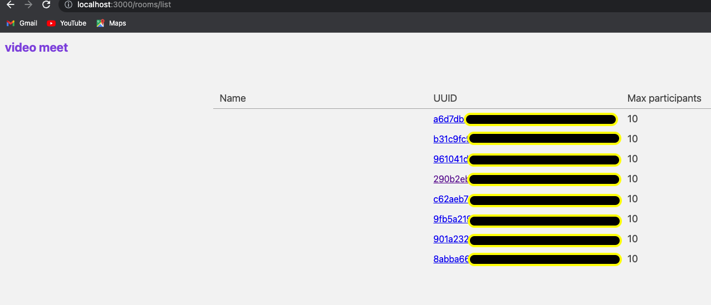
   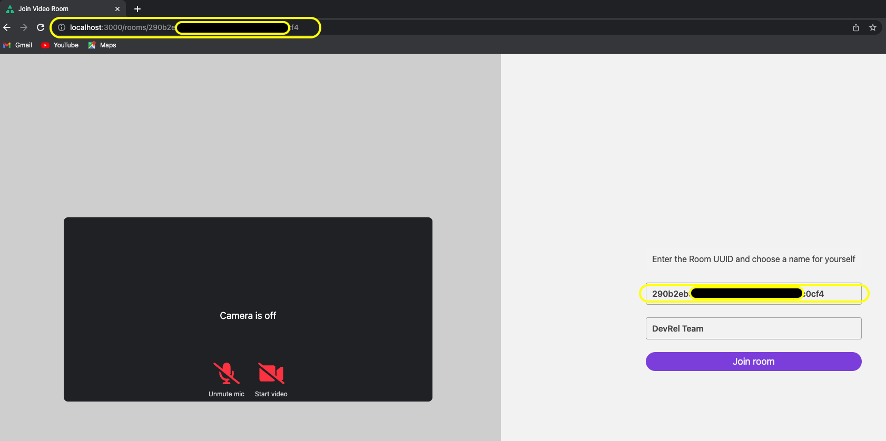
   
   Either way you choose, click on the `Unmute mic` and `Start video` icons to give respective permissions for telnyx meet to access audio and video.

   5 - Click on `Join Room` button to access the meeting.
   You should see a similar screen with various options as follows:
   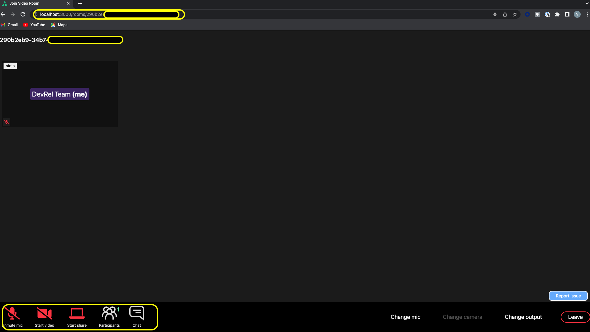
   
### Deploy on Vercel
You can deploy by directly importing [this project] to [Vercel](https://vercel.com/) 

[](https://vercel.com/new/git/external?repository-url=https://github.com/team-telnyx/telnyx-meet.git&project-name=telnyx-meet&repository-name=telnyx-meet&env=TELNYX_API_HOST,TELNYX_API_KEY&envDescription=Required%20to%20connect%20the%20app%20with%20TelnyxMeet&envLink=https://github.com/team-telnyx/telnyx-meet/#step-4-set-up-environment-variables)

- After you click Deploy, Select `Git Scope` from the drop down based on where you would like to create a clone of the `telnyx-meet` git repo. Check private Git Repository box if you would like make your repo private. 
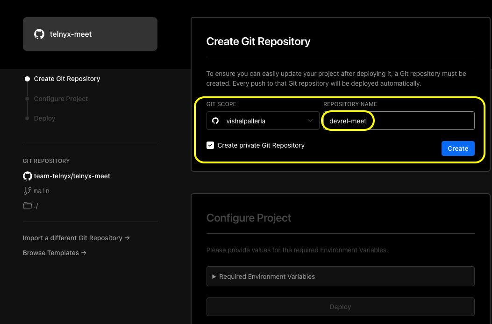
- Provide required environment variables values copying from the `.env.local` file 
-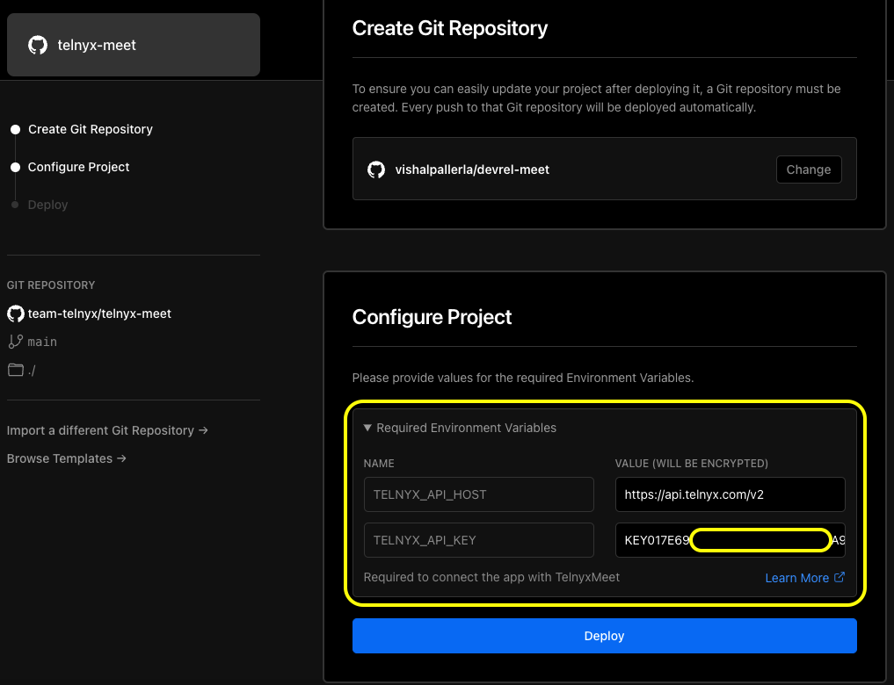
- Click Deploy and after few minutes, you should be directed to a screen with deployment successful message and your app should be live at a `URL` similar to [https://devrel-meet.vercel.app/](https://devrel-meet.vercel.app/) based on the name you provided for the repo.

**OR**

_Deploy your Local Project with the following instructions_

To deploy your local project to Vercel, push it to GitHub/GitLab/Bitbucket and [import to Vercel](https://vercel.com/new).

**Important**: When you import your project on Vercel, make sure to click on **Environment Variables** and set them to match your `.env.local` file.