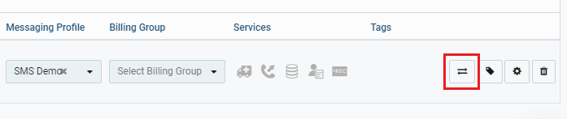

<div align="center">

# Send messages using Svelte and Telnyx API


A simple web based application for sending SMS using [Svelte framework](https://svelte.dev/) and [Telnyx API](https://telnyx.com).

</div>

## Prerequisite
 
 * Telnyx Developer Account (https://developers.telnyx.com/)
 * Code IDE or text Editor
 * [Node. js](https://nodejs.org/en/) ≥v6
 * npm
 * Familiarity with HTML, CSS, and JavaScript
 * A basic understanding of component-based frameworks like React is helpful but not required

  ## Steps

 ### Step 1: Telnyx Setup
 You need to sign up for Telnyx account, obtain a number with SMS capabilities and configure the number for messaging.
 <details>
<summary><strong>Steps to follow</strong> (click to expand)</summary><p>

 1. Sign up for Telnyx account
    > Set up a developer account with Telnyx from https://telnyx.com/sign-up.

 2. Obtain a number with SMS capabilities for the app
    > After creating an account and signing in, you need to [acquire a number](https://portal.telnyx.com/#/app/numbers/search-numbers) for the application. Search for a number by selecting your preferred 'Region' or 'Area Code'.
    
    > Make sure that the number supports SMS feature(Very Important!) as it will be used by our application.
 
 3. Create a messaging profile
    > Next create a [messaging profile](https://portal.telnyx.com/#/app/messaging) by clicking on "Add new profile" and provide a suitable profile name to it(you do not need to provide any other detail for now).

 4. Configure the number for messaging
    > Go to the [numbers](https://portal.telnyx.com/#/app/numbers/my-numbers) page, look for the number you created and set the number's `Messaging Profile` to the profile you created in the previous step. 
    
    <details>
    <summary>What if the Telnyx number is an international number for a User</summary>
    <br>    
    
    > If you want to send the message to a Telnyx number which is not in the country where you are, then you need to click on the 'Routing' option.
     
    
    > After clicking on 'Routing', a dialog box will open. In there, select the traffic type as "P2P" to allow International Inbound and Outbound SMS deliverability. And do not forget to save the changes!  

      
    </details>
    
 5. Acquire Telnyx API key
    > Go to the [API Keys](https://portal.telnyx.com/#/app/api-keys) page and copy the API Key for the future steps. Incase there is no API Key, then create one.

</p></details>

___

### Step 2: Svelte Setup
Svelte provides a different approach to building web apps than some of the other frameworks. While frameworks like React and Vue do the bulk of their work in the user's browser while the app is running, Svelte shifts that work into a compile step that happens only when you build your app, producing highly-optimized vanilla JavaScript.

<details>
<summary><strong>Steps to follow</strong> (click to expand)</summary><p>

 1. Create Svelte application skeleton
    > Open terminal/command prompt or code editor
    
    > Run following command
     ``` shell
    npx degit sveltejs/template YOUR_PROJECT_NAME
    ``` 
    degit is a project scaffolding tool to create skeleton. This will create a basic Svelte application code structure under the directory ‘YOUR_PROJET_NAME’.

 2. Install Required Dependencies
    > Please browse to YOUR_PROJECT_NAME directory and use the following command to install the required dependencies.
     ``` shell
    npm install # or yarn install
    ``` 
    It may take while to isntall the dependencies

 3. Run the skeleton app
    
    > Use the following command to run the skeleton app locally:
    ``` shell
    npm run dev # or yarn dev
    ```

    > Now you should see the message in your command prompt confirming the application is ready, and it is running locally on [<https://localhost:8080>]
    
    

    > Access the app on the above mentioned URL. You will see the following message from your Svelte app:

    
</p></details>

___

### Step 3: Creating SMS code
Once you have the Svelte set up complete, you need to make changes in it.
<details>
<summary><strong>Steps to follow</strong> (click to expand)</summary><p>

 1. Copy and paste code from [App.svelte](https://github.com/vidhanbhonsle/Send-messages-using-Svelte-and-Telnyx-API/blob/main/App.svelte) file
    
    > In your directory, look for 'src', it contains App.svelte file

    > Replace everything the code with the code provided in [App.svelte](https://github.com/vidhanbhonsle/Send-messages-using-Svelte-and-Telnyx-API/blob/main/App.svelte)

    > Provide "YOUR_KEY" and "YOUR_TELNYX_NUMBER" value which you acquired in step 1

 2. Run the code   

    > Save the work and run the code using following command:
     ``` shell
    npm run dev # or yarn dev
    ```

    > Open the link[<https://localhost:8080>] to the application in a browser of your choice and start sending SMS!
    
    
___

**Congratulations! You have created your own SMS App using Svelte and Telnyx API**
</p></details>

