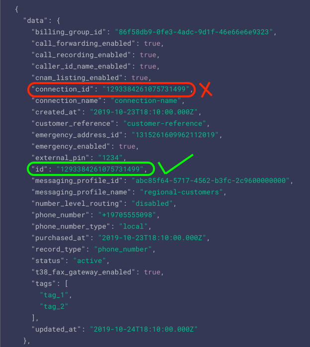

<div align="center">

# Traffic type Lookup: Determine which of the numbers support P2P


The code lets developer use Telnyx Number Configuration API to determine if a number supports P2P, A2P etc...
</div>

### Config File
One method for securing our confidential data like `API_KEY` and other values is to create variables for them and store them locally, for example in a config.py file and do not upload it to our public repository. Our config.py file may look like this:
```
api_key = '[YOUR API KEY]'
```
Later import this config file in actual code file using 

`import config`

### Fetch the ID of the phone number
Fetch the `id` of the [phone number](https://developers.telnyx.com/docs/api/v2/numbers/Number-Configurations#listPhoneNumbers) you are trying to determine the support types for. 
Make sure you are fetching `id` and not the `connection_id` for the phone number. 



Once you grabbed the `id`, save it in the config file with id variable. 
So, the final config file would look something like this:

```
api_key = '[YOUR API KEY]'
id = '[ID OF THE PHONE NUMBER TO LOOKUP]'
```


Actual code for traffic type lookup is in [trafficType.py](trafficType.py)

